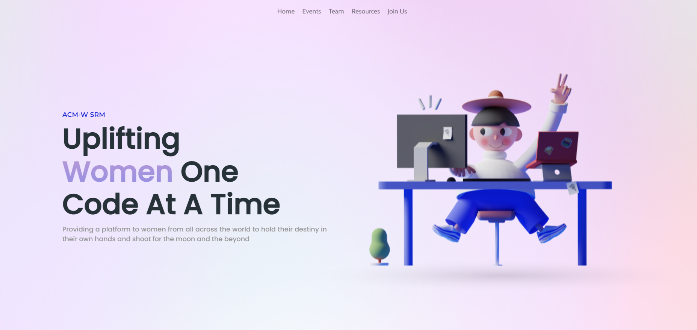
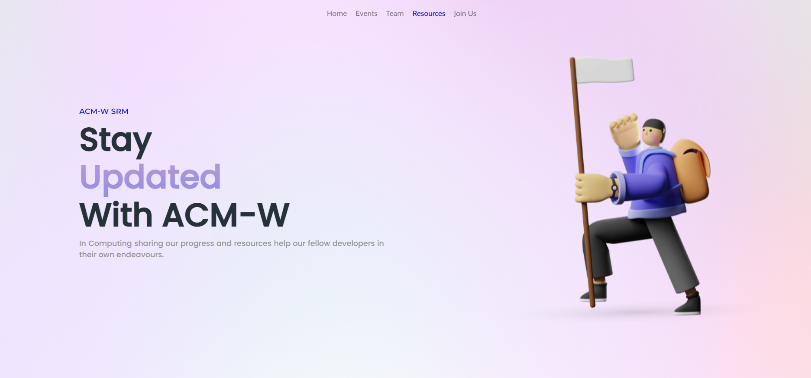

<h1 align="center"> ACM-W SRM Chapter</h1> 

crafted with &hearts; by WebDev Team

 

Built using:
  
   
     

 

## Preview

   

 
 
 

## Contributors

<table>
<tr align="center">

<th>Team Leads</th>

<td>

Utkarsh Sinha

  

</td>

<td>

Sanskriti Khare

</td>

</tr>

<tr align="center">
<th>Other Members</th>

<td>

Mahi Prasad

  

</td>

<td>

Sinjini Sarkar

</td>

<td>

Aastha Aggarwal

</td>

<td>

Palveet Kaur Saluja

</td>

</tr>

</table>
