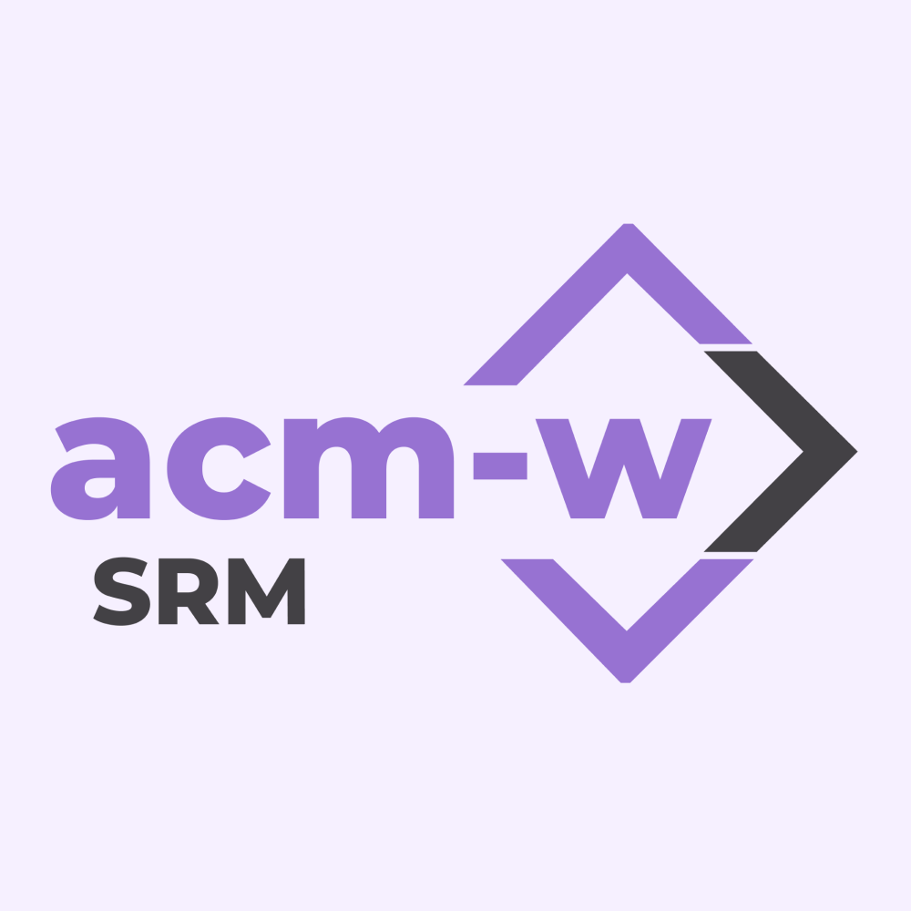
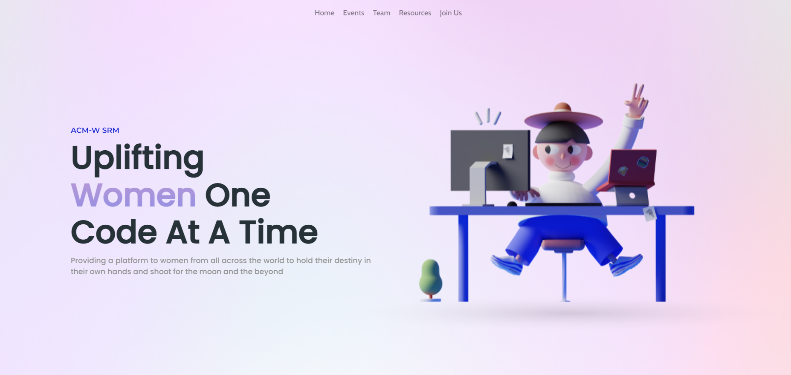

<h1 align="center"> ACM-W SRM </h1> 

crafted with &hearts; by WebDev Team

 

Built using:
  
   
     

 

## Preview

   

 
 
 

## Contributors

<table>

<tr>
<th>Team Leads</th>
<td>Utkarsh Sinha</td>
<td>Sanskriti Khare</td>
</tr>

<tr>
<th>Other Members</th>
<td>Mahi Prasad</td>
<td>Sinjini Sarkar</td>
<td>Aastha Aggarwal</td>
<td>Aayush Kumar</td>
<td>Palveet Kaur Saluja</td>
</tr>

</table>
